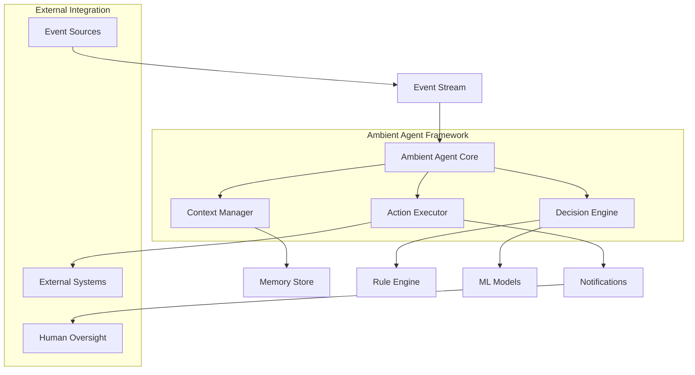

# Ambient Agents: The Next Evolution in AI Systems

## Introduction

The landscape of artificial intelligence is evolving beyond traditional chatbots and synchronous agents. Ambient agents are AI systems designed to run continuously and monitor for changes, events, or thresholds across a specific operational domain, representing a fundamental shift in how AI systems interact with their environment and users.

Unlike conventional AI applications that follow the familiar chat pattern, ambient agents are autonomous, event-driven AI systems that operate continuously in the background, without requiring direct human prompting. This new paradigm promises to transform enterprise automation and personal productivity by embedding intelligence directly into our digital workflows.

## Understanding Ambient Agent Architecture

### Core Components

Ambient agents are built on several key architectural principles that distinguish them from traditional AI systems:

#### 1. Event-Driven Operation
They subscribe to event streams and are triggered whenever relevant events occur. Unlike chatbots, which wait for user queries, ambient agents react as soon as new data arrives. This proactive approach enables real-time responses to changing conditions.

#### 2. Context Awareness
Unlike traditional chatbots or AI assistants that start fresh with each interaction, ambient agents maintain ongoing awareness of their environment and previous actions. This persistent context allows for more intelligent and nuanced decision-making.

#### 3. Governed Autonomy
The architectural elements—context awareness, event-driven operation, governed autonomy, and human-in-the-loop controls—form the blueprint of any capable ambient agent. Agents operate within defined boundaries while maintaining the ability to take autonomous actions.

#### 4. Ambient Functions
At their core, they use "ambient functions" - specialized operations that automatically trigger in response to specific conditions or state changes. These functions enable seamless integration with existing systems and workflows.

### Architecture Diagram



## Basic Functions of Ambient Agent Framework

### 1. Continuous Monitoring
Ambient agents continuously observe their environment, monitoring data streams, system states, and user behaviors without explicit prompts. This passive surveillance enables proactive responses to changing conditions.

### 2. Event Processing
The framework processes incoming events through sophisticated filtering and prioritization mechanisms, ensuring that only relevant events trigger agent responses.

### 3. Context Maintenance
Unlike stateless systems, ambient agents maintain rich contextual information across interactions, enabling more intelligent and personalized responses.

### 4. Autonomous Decision Making
Based on predefined rules, learned patterns, and contextual information, ambient agents make autonomous decisions within their operational boundaries.

### 5. Action Execution
Agents can perform actions across multiple systems, from sending notifications to updating databases or triggering complex workflows.

## Code Examples

### Basic Ambient Agent Implementation

Here's a simplified example of an ambient agent framework using Python:

```python
import asyncio
from typing import Dict, Any, Callable
from abc import ABC, abstractmethod

class Event:
    def __init__(self, event_type: str, data: Dict[str, Any], timestamp: float):
        self.event_type = event_type
        self.data = data
        self.timestamp = timestamp

class AmbientFunction(ABC):
    @abstractmethod
    async def should_trigger(self, event: Event, context: Dict[str, Any]) -> bool:
        pass
    
    @abstractmethod
    async def execute(self, event: Event, context: Dict[str, Any]) -> Any:
        pass

class EmailMonitorFunction(AmbientFunction):
    def __init__(self, priority_keywords: list):
        self.priority_keywords = priority_keywords
    
    async def should_trigger(self, event: Event, context: Dict[str, Any]) -> bool:
        if event.event_type == "email_received":
            email_content = event.data.get("content", "").lower()
            return any(keyword in email_content for keyword in self.priority_keywords)
        return False
    
    async def execute(self, event: Event, context: Dict[str, Any]) -> Any:
        # Process high-priority email
        sender = event.data.get("sender")
        subject = event.data.get("subject")
        
        # Update context with email information
        context["last_priority_email"] = {
            "sender": sender,
            "subject": subject,
            "timestamp": event.timestamp
        }
        
        # Trigger notification
        return {
            "action": "notify_user",
            "message": f"High priority email from {sender}: {subject}"
        }

class AmbientAgent:
    def __init__(self):
        self.functions: list[AmbientFunction] = []
        self.context: Dict[str, Any] = {}
        self.event_queue = asyncio.Queue()
        self.running = False
    
    def add_function(self, function: AmbientFunction):
        self.functions.append(function)
    
    async def process_event(self, event: Event):
        for function in self.functions:
            if await function.should_trigger(event, self.context):
                result = await function.execute(event, self.context)
                if result:
                    await self.handle_action(result)
    
    async def handle_action(self, action_result: Dict[str, Any]):
        action_type = action_result.get("action")
        if action_type == "notify_user":
            print(f"📧 Notification: {action_result.get('message')}")
    
    async def start(self):
        self.running = True
        while self.running:
            try:
                event = await asyncio.wait_for(self.event_queue.get(), timeout=1.0)
                await self.process_event(event)
            except asyncio.TimeoutError:
                continue  # Keep running even if no events
    
    async def add_event(self, event: Event):
        await self.event_queue.put(event)
    
    def stop(self):
        self.running = False

# Usage example
async def main():
    agent = AmbientAgent()
    
    # Add email monitoring function
    email_monitor = EmailMonitorFunction(["urgent", "critical", "asap"])
    agent.add_function(email_monitor)
    
    # Start agent in background
    agent_task = asyncio.create_task(agent.start())
    
    # Simulate incoming events
    urgent_email = Event("email_received", {
        "sender": "boss@company.com",
        "subject": "Urgent: Server Down",
        "content": "We have an urgent server issue that needs immediate attention."
    }, asyncio.get_event_loop().time())
    
    await agent.add_event(urgent_email)
    
    # Let the agent process for a few seconds
    await asyncio.sleep(2)
    
    agent.stop()
    await agent_task

# Run the example
# asyncio.run(main())
```

## Use Cases and Applications

### 1. Email Management Assistant
An ambient agent can monitor your email continuously, automatically categorizing messages, flagging urgent communications, and even drafting preliminary responses for routine inquiries.

**Example Scenario**: The agent detects an email from a key client containing the word "urgent." It immediately notifies you via Slack, creates a calendar reminder, and prepares a draft response acknowledging receipt.

### 2. System Health Monitoring
Specialized ambient agents will activate, analyze the orchestrator's input, and engage other agents and back-end systems to gather whatever data is needed to reason, respond, and take action.

**Example Scenario**: An ambient agent monitors server metrics continuously. When CPU usage exceeds 85% for more than 5 minutes, it automatically scales resources, notifies the DevOps team, and logs the incident.

### 3. Customer Service Optimization
Ambient agents can monitor customer interactions across multiple channels, identifying patterns and proactively addressing issues before they escalate.

**Example Scenario**: The agent detects multiple customer complaints about a specific product feature on social media and automatically creates support tickets, notifies product managers, and suggests knowledge base updates.

### 4. Personal Productivity Assistant
These agents can observe your work patterns and proactively suggest optimizations, schedule breaks, and manage your digital workspace.

**Example Scenario**: The agent notices you've been in back-to-back meetings for 3 hours and automatically books a 15-minute break in your calendar while suggesting a brief walk reminder.

### 5. Financial Monitoring and Alerts
Ambient agents can continuously monitor financial accounts, market conditions, and spending patterns to provide real-time insights and alerts.

**Example Scenario**: The agent detects unusual spending patterns and market volatility affecting your portfolio, automatically rebalancing investments within predefined risk parameters and notifying you of significant changes.


### Evaluation Framework

```python
class AmbientAgentEvaluator:
    def __init__(self):
        self.metrics = {
            "response_time": [],
            "accuracy": [],
            "user_satisfaction": [],
            "false_positive_rate": [],
            "system_efficiency": []
        }
    
    def evaluate_response_time(self, event_timestamp, action_timestamp):
        """Measure time between event detection and action execution"""
        response_time = action_timestamp - event_timestamp
        self.metrics["response_time"].append(response_time)
        return response_time
    
    def evaluate_accuracy(self, expected_action, actual_action):
        """Assess correctness of agent actions"""
        accuracy = 1.0 if expected_action == actual_action else 0.0
        self.metrics["accuracy"].append(accuracy)
        return accuracy
    
    def generate_report(self):
        """Generate comprehensive evaluation report"""
        report = {}
        for metric, values in self.metrics.items():
            if values:
                report[metric] = {
                    "average": sum(values) / len(values),
                    "count": len(values),
                    "min": min(values),
                    "max": max(values)
                }
        return report
```


## Conclusion

Ambient agents represent a paradigm shift from reactive AI systems to proactive, context-aware intelligence that operates continuously in our digital environments. By moving beyond the limitations of traditional chatbots and synchronous agents, these systems promise to reduce cognitive overhead, improve decision-making, and enable new levels of automation and efficiency.


---

*This blog post explores the emerging field of ambient agents based on recent developments in agentic AI architectures. As this technology continues to evolve rapidly, implementations and best practices will likely advance significantly in the coming months.*